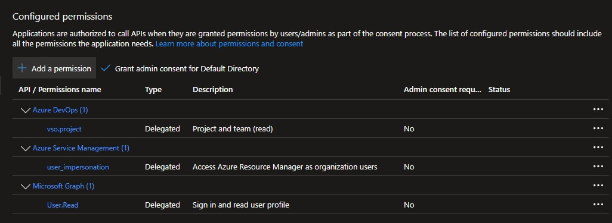

# Orchestrator portal

The Orchestrator Portal is an application intended to provide dynamic input selection for Azure DevOps pipelines that automate Azure DevOps project setup and configuration. It does not replace Azure DevOps; instead, it acts as an abstraction layer focused on input selection and orchestration.

Core capabilities such as logic, governance, accountability, observability, and monitoring remain managed at the Azure DevOps level.

## Features

- Automates Azure DevOps project creation
- Creates and manages service connections
- Creates and manages variable groups
- Allow to Create resources to be assigned to service connections for RBAC
- Allow variable that are replaced on runtime to defined complex names
- Generates an output JSON file that can be passed to Azure DevOps pipelines to drive automation

## Architecture

## Entra ID (Azure AD) Requirements

- No database is required to discover subscriptions, resources or Azure DevOps projects; all information is obtained using the permissions of the logged-in user

- Local key value database is created to store configuration

- Works with Azure application registrations that are multi-tenant or single-tenant, including those that allow personal accounts

- Tenant discovery and feature usage require a user who belongs to an Entra ID directory

- Personal accounts (for example, @outlook.com) can sign in but cannot perform actions, as they are not members of an Entra ID directory

- The TenantId value in appsettings.json must be configured according to the application registration type; it is currently set up for a multi-tenant application that includes personal accounts

## Azure DevOps Permissions

The signed-in user must have sufficient permissions in Azure DevOps to:

- Read Azure Devops projects

Typical required roles include:

- Add user as Reader at project scope in Azure Devops 

## Azure (ARM) Permissions

The signed-in user must have Reader access to the target Azure subscriptions and resource groups in order to:

- List subscriptions and resources 

Typical required roles include:

- Reader Rbac (minimum, for discovery)